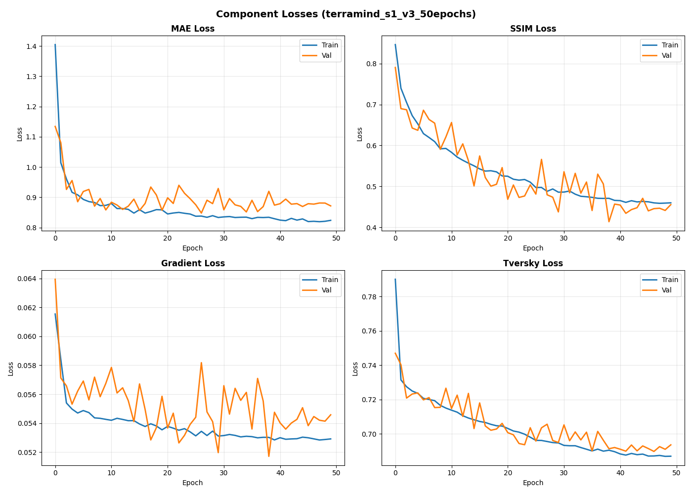
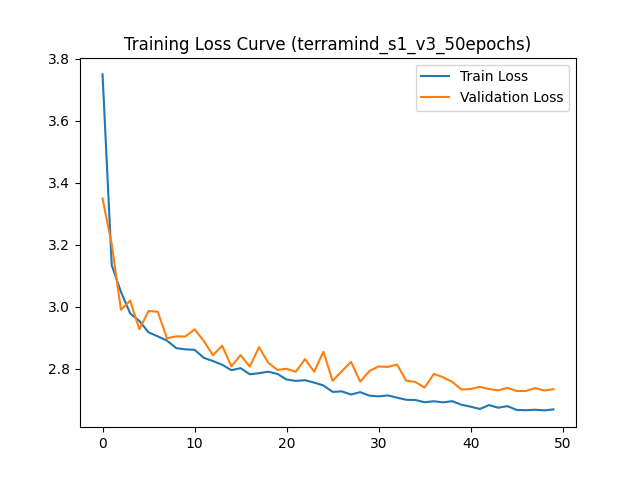
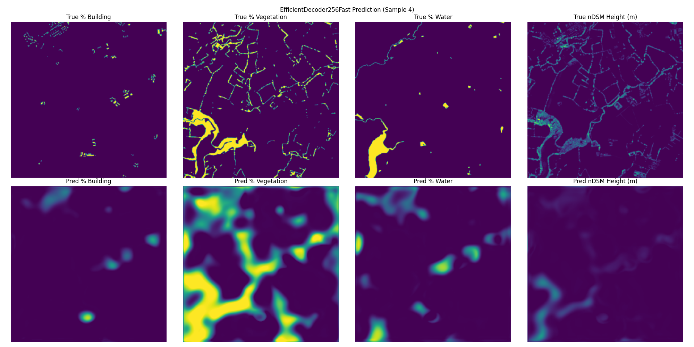
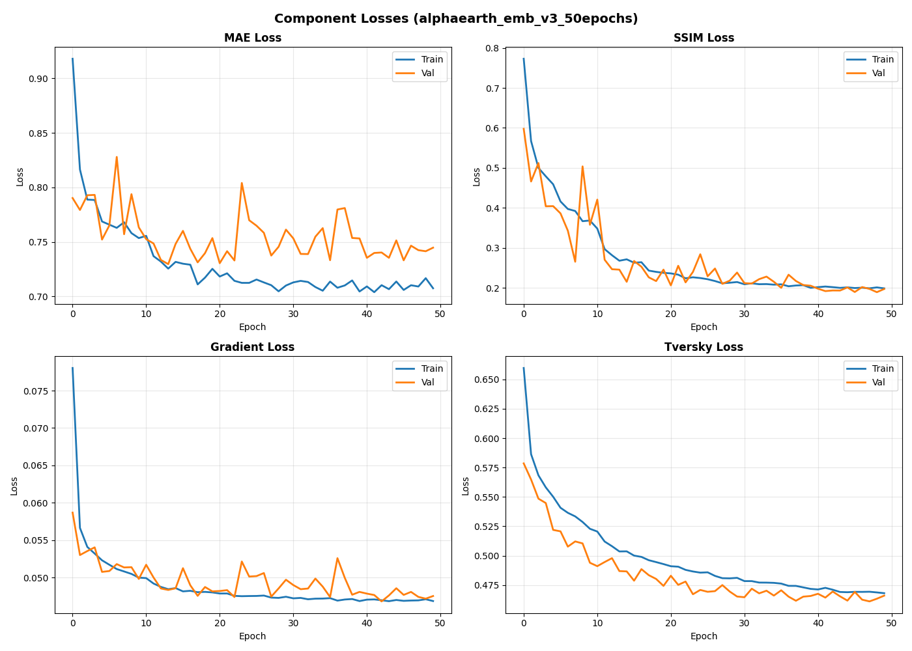
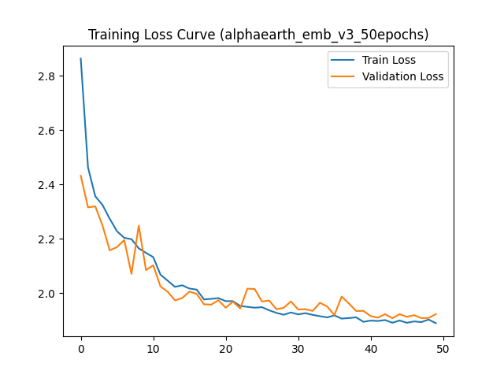
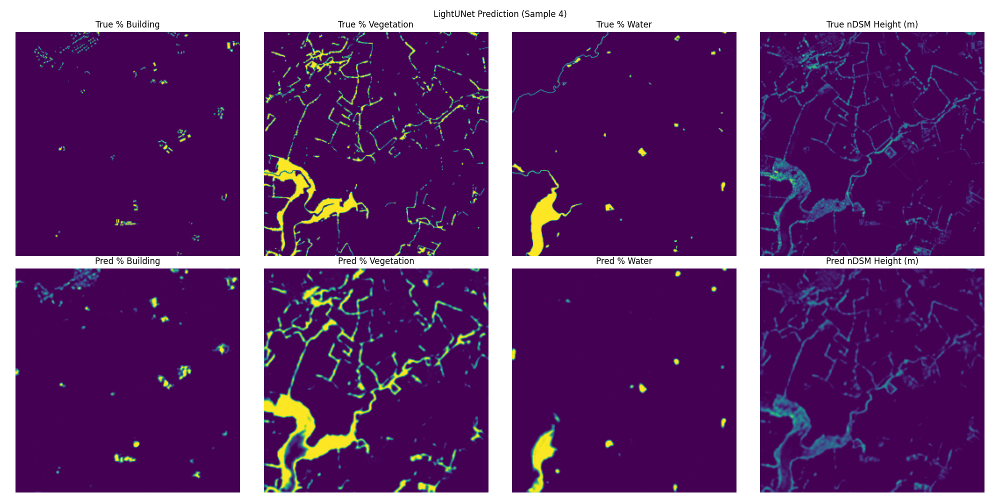
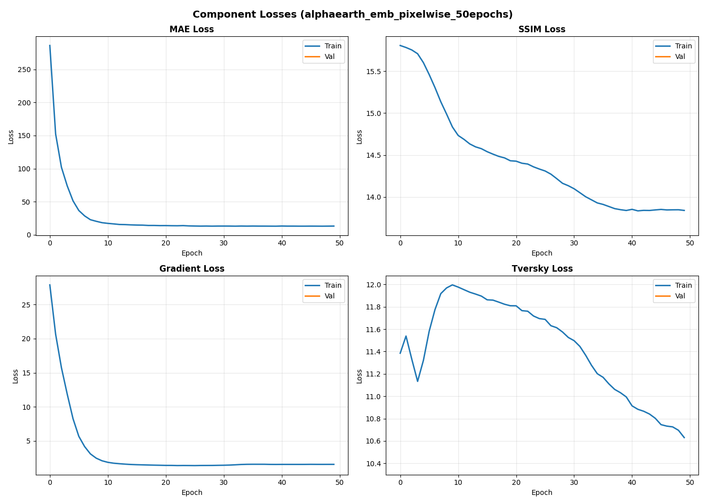
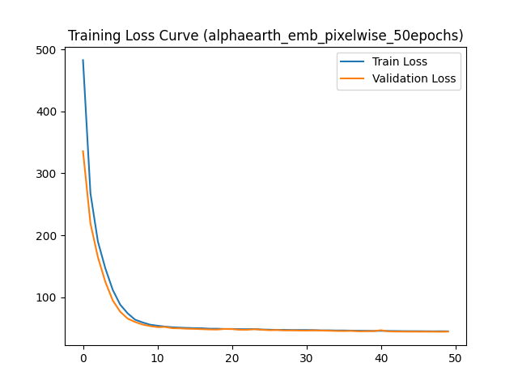
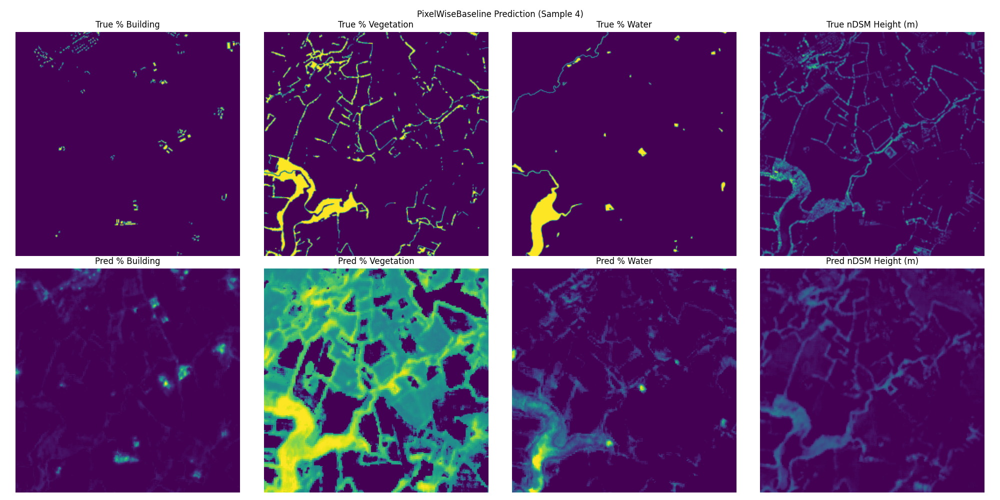

# Solution for embed2heights Challenge - Reaching New Heights with GeoFM Embeddings

Team: 2theMoon 

Team members:
- Agata Kaczmarek
- Mateusz Stączek


## Challenge TLDR (simplified)

Goal: predict 4 channel outputs given aerial photos embeddings:
    - 3x image segmentation (buildings, vegetation, water, scale 0-1),
    - 1x height regression (relative, scale 0-1, already normalized labels),

Input: 
    - embeddings of images of earth computed with different models. 
        - 4 folders with embeddings of shapes 16x16x768,
        - 2 folders with embeddings of shapes 256x256x64 (or x128),
    - correct labels - 256x256x4, each output channel represents a different goal.

Output:
    - 256x256x4 matrices, with channels representing predictions for different tasks (segmentation/regression).


## Links

- Competition: https://platform.ai4eo.eu/geoai/data
- Dataset: https://www.eotdl.com/datasets/embed2heights
- Sample repo code: https://github.com/VMarsocci/emb2heights-baselines/tree/main
- Drive: https://drive.google.com/drive/folders/1yxXF3bJ1C6zCsZ1XLQWnNfkf98VI-21f

### Also see [ALL DESCRIPTIONS IN ONE PLACE](readme_copies.md)


# Experiments

| Name                                             | DATA         | MODEL            | final_score | iou_build | iou_veg | iou_water | rmse_h_build | rmse_h_veg |
|--------------------------------------------------|--------------|------------------|-------------|-----------|---------|-----------|--------------|------------|
| 1) Baseline terramind_s1 50 epochs               | terramind_s1 | decoder_residual | 0.1380      | 0.1175    | 0.5988  | 0.1253    | 3.2991       | 6.8749     |
| 2) Baseline alphaearth 50 epochs                 | alphaearth   | lightunet        | 0.3558      | 0.3270    | 0.7761  | 0.3957    | 2.3230       | 3.9531     |
| 3) Baseline alphaearth 50 epochs pixelwise model | alphaearth   | pixelwise        | 0.1898      | 0.1655    | 0.5696  | 0.2146    | 2.7266       | 4.7987     |

### Models

- decoder_residual: 
    - basic decoder model: (counts of channels) 768 -> 256 -> 128 -> 64 -> 32 -> 16 -> 4,
    - expects input 16x16, then scales it up so has poor final output resolution,
    - provided by challenge organizers in a sample solution,
- lightunet:
    - simple unet model: (counts of channels):
        - down: 64/128 -> 32 -> 64 -> 128 -> 256,
        - up: 256 -> 128 + concat -> 64 + concat -> 32 + concat -> 4,
    - provided by challenge organizers in a sample solution,
- pixelwise:
    - 2 simple convolution layers with kernel size 1 and ReLU between,
        - equivalent to a simple MLP applied to each pixel independently,
        - channels counts: 128/64 -> 16 -> 4,
    - no spatial awareness / no neighbor pixels taken into account,


## 1) Baseline terramind_s1 50 epochs

| Component Losses                                        | Loss Curve                                        |
| ------------------------------------------------------- | ------------------------------------------------- |
|  |  |




## 2) Baseline alphaearth 50 epochs

| Component Losses                                          | Loss Curve                                          |
| --------------------------------------------------------- | --------------------------------------------------- |
|  |  |



## 3) Baseline alphaearth 50 epochs pixelwise model

| Component Losses                                                 | Loss Curve                                                 |
| ---------------------------------------------------------------- | ---------------------------------------------------------- |
|  |  |




---

# Local setup

## Create local symlink to data in NAS

Usable in VS Code, from local folder to sample shared network drive.
```bash
mklink /D C:\Users\matem\T\python_projects\philab\data_from_drive\public \\192.168.0.77\public\philab-dataset
```

Optionally, to re-download data:
```bash
pip install eotdl 
eotdl datasets get embed2heights --path . --version 1
eotdl datasets get embed2heights --path . --version 1 --assets --verbose --force 
```

## Installation (ours)

Create new venv called .venv:
```bash
python -m venv .venv
```

Activate venv:
```bash
# Windows:
.venv\Scripts\activate
# Linux 
source .venv/bin/activate
```

then install requirements:
```bash
pip install -r requirements.txt
```

## Copy and split data from labelled dataset to train/test

Target is a separate folder in NAS, e.g.: terramind_s1_train_test_split:

```bash
python split_data.py --train-ratio 0.8 --source-embeddings-dir data/public/embed2heights/data/train/terramind_s1_emb --source-targets-dir data/public/embed2heights/data/train/labels --train-embeddings-output-dir data/public/terramind_s1_train_test_split/train/embeddings --train-targets-output-dir data/public/terramind_s1_train_test_split/train/labels --test-embeddings-output-dir data/public/terramind_s1_train_test_split/test/embeddings --test-targets-output-dir data/public/terramind_s1_train_test_split/test/labels
```

## Run training

Internally, it handles train/val splitting of the input data BUT by splitting data earlier and passing a single split, we can limit the size of the dataset for training.

```bash
python train.py --model-type decoder_residual --output-dir runs --train-embeddings-dir data/terramind_s1_train_test_split/test/embeddings --train-targets-dir data/terramind_s1_train_test_split/test/labels --experiment-name test_terramind_s1_decoder_residual_v2 --epochs 10 --batch-size 16 --patch-size 256 --device cuda
```

Run training and predictions and saving submission to zip all in one:

```bash
python train.py --model-type lightunet --output-dir runs --train-embeddings-dir data/embed2heights/data/train/alphaearth_emb --train-targets-dir data/embed2heights/data/train/labels --experiment-name alphaearth_emb_v3_50epochs --epochs 50 --batch-size 4 --patch-size 256 --device cuda --test-submission-embeddings-dir data/embed2heights/data/test/alphaearth_test_emb --predictions-subfolder predictions_submission --zip-output submission_50_epochs_alphaearth.zip
```
or
```bash
python train.py --model-type pixelwise --output-dir runs --train-embeddings-dir data/embed2heights/data/train/alphaearth_emb --train-targets-dir data/embed2heights/data/train/labels --experiment-name alphaearth_emb_pixelwise_50epochs --epochs 50 --batch-size 16 --patch-size 256 --device cuda --test-submission-embeddings-dir data/embed2heights/data/test/alphaearth_test_emb --predictions-subfolder predictions_submission --zip-output submission_50_epochs_alphaearth_pixelwise.zip
```

## Run predict

Save a few train predictions
```bash
python predict.py --experiment-name test_terramind_s1_decoder_residual_v2_cuda --base-dir runs --model-type decoder_residual --model-path runs/test_terramind_s1_decoder_residual_v2_cuda/model_best.pth --test-embeddings-dir data/terramind_s1_train_test_split/test/embeddings --predictions-dir runs/test_terramind_s1_decoder_residual_v2_cuda/predictions_train --patch-size 256 --max-samples 5 --device cuda
```

Test 5 samples predictions
```bash
python predict.py --experiment-name test_terramind_s1_decoder_residual --base-dir runs --model-type decoder_residual --model-path runs/test_terramind_s1_decoder_residual/model_best.pth --test-embeddings-dir data/public/embed2heights/data/test/terramind_test_s1_emb --predictions-dir runs/test_terramind_s1_decoder_residual/predictions --patch-size 256 --max-samples 5 --device cuda
```

Compute all predictions (with --zip-output to create a zip in `submissions/` folder)
```bash
python predict.py --experiment-name test_terramind_s1_decoder_residual --base-dir runs --model-type decoder_residual --model-path runs/test_terramind_s1_decoder_residual/model_best.pth --test-embeddings-dir data/public/embed2heights/data/test/terramind_test_s1_emb --predictions-dir runs/test_terramind_s1_decoder_residual/predictions --patch-size 256 --device cuda --zip-output submission.zip
```

## Send submission

Filenames pattern must be `3123_AB_2022.npy` where `2022` comes from the source embedding filename, and there is no `pred_` or `label_` prefix.

Create a zip with a `submissions/` folder with all 946 npy predictions by adding a --zip-output arg to `predict.py` script. (Alternative: use last cell in `starter_pack-embed2heights.ipynb.`)

Upload the `submission.zip` file to https://platform.ai4eo.eu/geoai/submissions (can be uploaded every 12h).
